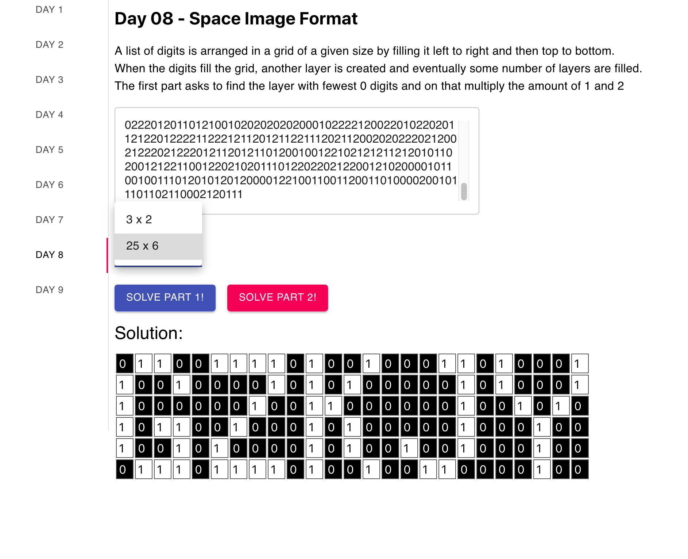

# Advent2019

Attempt at solving Advent of code 2019 with an app using a Phoenix backend and a React frontend written in Typescript.

👌Comments are welcome, it's my first project using Phoenix and also Typescript :)

## Screenshot

## How to run
You need a recent Elixir and Node.js. Then run:

    `make build-and-serve`

it will be visible at localhost:4000

To run in dev mode (that is, the frontend reloads on the fly), use `yarn start` in the `assets` folder (will expose the app at port 3000) and `mix phx.server` to run the backend at port 4000. The `proxy` option in the package.json will redirect requests to port 3000 to the actual backend.

## Performance profiling
Use `mix Exprof` to profile the most critical parts of the backend.

## Dialyze check
Use `mix dialyze` to statically check the types n the whole project

## Current state

- day 1 ok!
- day 2 ok!
- day 3 ok!
- day 4 ok!
- day 5 ok!
- day 6 performance issue, the `mix profile` task profiles it. It is doing more than needed, the problem asks to *count* the paths and I'm enumerating them. The graph representation in the frontend doesn't scale with so many edges and is disabled.
- day 7 part 1 done, part 2 gives invalid results but don't know where the error is
- day 8 ok! The space image parsing was initially slow, now fixed
- 9 based on intcode computer, skipped for a better day
- 10 completed, visualization could be fun to add
- 12 done, a concurrent solution allows to explore the system periodicity in different axis quicker.
- 13 skipped for now because of IntCode computer
- day 14 skipped, needs some trick to optimize stoichiometry and reuse reagents
- day 15 skipped because intcode
- day 16 skipped for now as the problem definition is quite complex
- day 17 skipped because intcode
- day 18 is intriguing :) Implemented a solution for part 1 but it's megaslow. Drafted an improvement based on pruning. Also, weird Dialyze issues.
- day 19 skipped because intcode
- day 20

## 📓 development notes
These notes are here so I can remember how I built this in the future.

This app was created with:

`mix phx.new advent2019 --no-ecto --no-webpack --no-html`

Then in the folder I create the boilerplate react app:
`npx create-react-app assets --typescript`

The normal build with `yarn build` can be then exposed by modifying `plug Plug.Static` in `lib/advent2019_web/endpoint.ex`.

## TODO
- [x] find a way to serve the app using `yarn serve` and its reload in development
- [ ] understand what exactly the `only` parameter of Plug.Static does and configure it properly
- [x] tests, maybe try TDD?
- [x] tests are executed only when the file is specified to `mix test`, why are they not mounted? (solution: because I wrote `text`, not `test` -_-)
- [x] multiple days in same app
- [ ] error management in case of weird API call content
- [ ] make it responsive (it breaks on phone)
- [ ] improve a11y
- [ ] dockerize
- [ ] use proper logging for the BE
- [ ] code review based on experienced Elixir users and comparison with other people solutions, subsequent Anki deck creation (maybe a shared deck and a link to it?)

## License

This is MIT licensed, please do pretty much whatever you want with it
